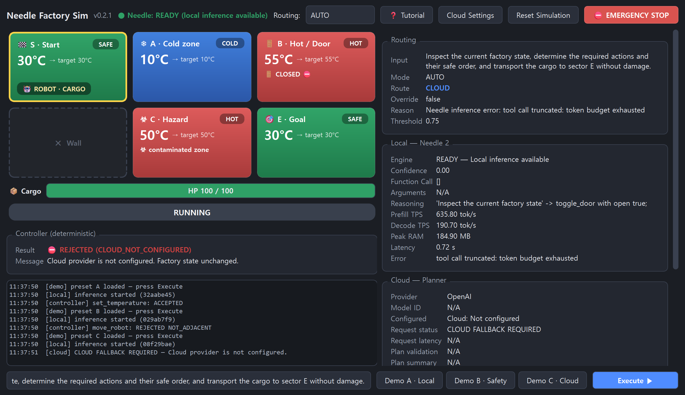
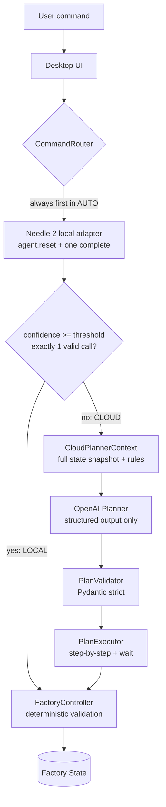

# Needle Factory Sim

[](https://github.com/sinbumu/needle-factory-sim/actions/workflows/tests.yml)
[](LICENSE)

**Edge AI hybrid control PoC** — a desktop factory simulation where a 14MB local
SLM (**Needle 2**) converts explicit natural-language commands into tool-call
candidates, a **Cloud LLM** (OpenAI) plans multi-step goal-oriented missions, and a
**deterministic FactoryController** is the only component allowed to change the
factory state — no matter which AI produced the command.



## Why Needle

Needle 2 (`cactus-needle`) is a tiny local model purpose-built for turning natural
language into constrained, schema-valid function calls — with a **calibrated
confidence score** per response. That makes it a natural edge-side gatekeeper:

- Explicit single commands ("Set sector A temperature to 30 degrees") are handled
  fully on-device: ~0.1 s latency, ~350 tok/s decode, ~55 MB RAM, no network.
- Goal-oriented requests that require knowing the whole factory state produce low
  confidence or no call — a measurable, honest signal to escalate to the cloud.

## Architecture



### Local vs Cloud roles

| | Local (Needle 2) | Cloud (OpenAI) |
|---|---|---|
| Sees | Only the user's sentence | Full factory snapshot + explicit rules |
| Produces | Exactly one tool-call **candidate** | A structured **ExecutionPlan** (max 8 steps, `wait` allowed) |
| Executes tools | Never (`agent.run()` is not used) | Never (no tool-calling agent) |
| Escalation | confidence < threshold, 0 or 2+ calls, error → Cloud | — |

### FactoryController safety boundary

Neither AI mutates state. Every action — local candidate or cloud plan step — is
re-validated against the **live** state at execution time: adjacency, target
temperature safety, door state, contamination rules, mission status. A rejected
action changes nothing (`state_changed = false`). *A valid AI tool call is not
the same thing as a valid physical action* — Demo B shows this on screen.

## UI

Dark-themed single-window dashboard (PySide6, no image assets):

- **First-launch tutorial**: a guided coach-mark tour walks through every
  control (map, command input, demos, routing, cloud settings, monitor,
  e-stop, reset). It appears automatically only on the very first launch and
  can be reopened anytime with the **❓ Tutorial** button in the top bar.
- Command input keeps a history — **↑ / ↓** recalls previously executed
  commands; the event log is timestamped.

- **Left**: the 2×3 factory map as temperature-gradient sector cards (blue =
  cold, green = safe, red = hot) with kind icons, door/contamination badges and
  a yellow highlight on the robot's sector; below it the cargo HP bar (colored
  by health), the mission status pill, the **deterministic controller verdict**
  (✅ ACCEPTED / ⛔ REJECTED + reason) and the event log — all visible without
  scrolling.
- **Right**: the AI monitor — routing decision (mode / route / override /
  reason / threshold), Needle telemetry (confidence, function call, reasoning,
  TPS, RAM, latency), cloud planner status and the plan step table with live
  per-step statuses.

## Requirements

- Windows 11 x64 (primary target; the code is plain PySide6/Python)
- Python 3.11+
- [`uv`](https://docs.astral.sh/uv/) (`python -m pip install uv` works)
- Internet **once**, for dependency install and the first Needle engine/model
  provisioning (cached under `~/.cache/cactus-needle` / HuggingFace cache).
  After that, local inference runs fully offline.

## Download (Windows installer)

Grab `NeedleFactorySim-Setup-<version>.exe` from the
[Releases](https://github.com/sinbumu/needle-factory-sim/releases) page.
It installs per-user (no admin rights needed) and adds a Start Menu entry.

> The installer is not code-signed, so Windows SmartScreen will warn about an
> unknown publisher — choose **More info → Run anyway**.

The installer does not bundle the Needle engine/model; the app downloads them
to `~/.cache/cactus-needle` on first launch (internet needed once), then local
inference runs offline.

To rebuild the installer yourself: `scripts/build_installer.ps1`
(PyInstaller onedir via [packaging/NeedleFactorySim.spec](packaging/NeedleFactorySim.spec),
then Inno Setup via [packaging/installer.iss](packaging/installer.iss)).

## Installation & Run (from source)

```bash
uv sync
uv run python -m needle_factory_sim
```

or on Windows just double-click:

```text
run.bat
```

The first `Needle(...)` initialization downloads the engine + base model; the UI
shows `Needle: INITIALIZING...` → `READY (local inference available)`.
Engine binaries are never committed to this repository.

## Cloud Settings (session-only API key)

`Cloud Settings` opens a dialog with **Provider (OpenAI, fixed)**, **API Key**
(password-masked), **Model ID** (your choice, e.g. `gpt-4.1`) and the
**Confidence Threshold** (default 0.75).

- The API key lives **only in process memory** — never written to `.env`, config
  files, registry, logs, or the monitor, and it is gone when the app exits.
- `Reset Simulation` keeps the key/model/threshold; restarting the app does not.
- The monitor only ever shows `Cloud: Configured` / `Cloud: Not configured`.
- **Test connection** verifies the key and model ID before you rely on them
  (it resolves the model, so it spends no tokens) and reports failures with the
  key redacted.

Routing modes: `AUTO` (Needle first, escalate on low confidence), `FORCE LOCAL`
(no cloud escalation), `FORCE CLOUD` (skips Needle; the monitor shows
`OVERRIDE = TRUE` so it can't be mistaken for an AUTO result).

## Demos

Demo buttons reset the simulation and prefill the prompt; press **Execute**.
All three start from the identical initial state.

> The spec's original demo prompts are Korean. Spike measurement (3 runs each)
> showed the Needle 2 **base** model is unstable on Korean (confidence 0.00–0.21,
> wrong sector extraction), so per the plan's fallback rule the demo buttons use
> English prompts. Korean prompts are kept in `constants.DEMO_PROMPTS_KR` and can
> be typed manually — they will honestly route to CLOUD.

### Demo A — Local edge control
`Set sector A temperature to 30 degrees.` → Needle returns exactly one
`set_temperature(A, 30)` call at confidence **~0.81** → routed LOCAL → controller
accepts → A's temperature glides 10 °C → 30 °C at 10 °C/s. The monitor shows real
TPS / RAM / latency telemetry.

### Demo B — Safety guard
`Move the robot directly to sector E.` → Needle confidently (**~0.96**) produces
`move_robot(E)` — a perfectly valid **tool call** — but E is not adjacent to S,
so the controller rejects it: `REJECTED (NOT_ADJACENT)`, state unchanged.

### Demo C — Hybrid cloud planning
The goal-oriented transport request gives Needle nothing explicit to extract; it
errors/returns no call (confidence 0.00) → AUTO escalates to CLOUD. The planner
receives the full snapshot + rules and returns a strict `ExecutionPlan`
(typically: warm A, cool B, wait, open B's door, move S→A→B→E). The PlanExecutor
runs it step-by-step — each step re-validated by the controller, `wait` handled
by cancellable timers while temperatures keep transitioning and the UI stays
responsive. Without a configured key it shows `CLOUD FALLBACK REQUIRED` and
changes nothing.

**Live Cloud call requires a user-provided API key and model ID.** The cloud
adapter, plan schema, validation and execution paths are fully implemented and
verified with fixture plans; no fake keys or canned AI responses exist in the code.

## Paraphrase robustness — how Needle understands varied English

You don't have to type the exact demo sentences. "Go to sector A", "Warm up
sector A to 30 degrees", "Clean up sector C", "Stop everything right now!" all
execute locally. This was tuned **without any fine-tuning**, using the one lever
the Needle 2 base model exposes:

**Mechanism.** Needle builds its tool-call grammar and its calibrated confidence
from the **tool docstrings and per-argument descriptions**. Those texts are the
model's only knowledge of what each tool means, so wording them with the verbs
users actually say directly raises confidence on paraphrases. We enriched them
with synonym hints, e.g.:

| Tool | Description now says |
|---|---|
| `move_robot` | "Move, go, head, drive, or send the transport robot …" |
| `set_temperature` | "Set, change, adjust, warm up, or cool down the target temperature …" |
| `toggle_door` | explicit mappings: *"open the door" → open=true, "close/shut the door" → open=false* |
| `reset_sector` | "Reset, clean, clean up, decontaminate, or clear the contamination …" |
| `emergency_stop` | "… immediately stop everything, halt all operations, or abort …" |

**Measured, not assumed.** [scripts/paraphrase_spike.py](scripts/paraphrase_spike.py)
runs 25 paraphrased commands against the real model and counts how many produce
the exact intended call above the 0.75 threshold:

| | Local execution | Wrong actions executed |
|---|---|---|
| Before | 14 / 25 (56%) | 0 |
| After | **20 / 25 (80%)** | **0** |

Per action (after): move 4/6 · temperature 6/6 · door 2/5 · reset 4/4 · e-stop 4/4.

**Safety-first trade-offs.** Two synonym groups were deliberately *left out*:

- *"unlock/lock the door"* — the model confidently inverted the boolean
  (`unlock` → `open=false`). Since a confident **wrong** action is worse than an
  escalation, the words were removed from the description; "unlock" now yields
  low confidence and routes to CLOUD instead of executing incorrectly.
- *"take/bring/carry the cargo to …"* — reinforcing these would make Demo C's
  goal-oriented sentence ("… transport the cargo to sector E …") match
  `move_robot(E)` with high confidence and break its intended CLOUD escalation.

Every remaining miss fails **safe**: low confidence → CLOUD escalation, never a
wrong local execution. Demo A/B/C routing was re-verified unchanged after the
tuning (3 runs each: LOCAL / LOCAL / CLOUD). If you edit the docstrings, re-run
the spike to keep these properties.

## Tests

```bash
uv run pytest
```

105 tests, run on Ubuntu and Windows by
[CI](.github/workflows/tests.yml) on every push. They cover:

- **Controller rules** — adjacency, unsafe temperature, doors,
  contamination/reset, cargo damage, game over, emergency stop, reset
- **Confidence routing** — mocked Needle responses, including malformed ones
- **Plan validation** — step/wait limits, order contiguity, extra-field rejection
- **Plan executor** — sequencing, wait steps, cancellation, failure policy, and
  re-validation against live state rather than the planning snapshot
- **Cloud planner** — context construction, structured-output handling, the
  JSON-mode fallback, error classification, and that the API key never appears
  in an error message
- **UI widgets** — command history recall, Cloud Settings credential handling,
  worker-thread handover on close
- **Input hardening** — malformed AI arguments (`true`, `"30"`, fractional
  values) must escalate to CLOUD rather than be coerced into a valid-but-wrong
  action; unusable confidence (NaN, out of range) never routes LOCAL
- **Terminal-state rules** — Emergency Stop cannot hide a GAME OVER, a won
  mission is terminal, time stops when a run ends
- **Safety regressions** — the defects fixed in v0.1.4 and v0.1.5

No test needs a network, a cloud key, or a display. Scripts that exercise the
real model separately: `scripts/needle_spike.py` (demo prompt routing),
`scripts/paraphrase_spike.py` (paraphrase robustness),
`scripts/demo_smoke.py` (Demo A/B/C end-to-end) and
`scripts/safety_check.py` (window-level emergency-stop / reset / tutorial checks).

## Known limitations

- The Needle 2 base model handles Korean poorly (measured, see above) — demo
  prompts default to English; UI labels are unaffected. Fine-tuning is out of scope.
- Some paraphrases still escalate to CLOUD (e.g. "shut the door", targets
  without the word *sector* like "Drive to E") — see the paraphrase section.
- Live cloud planning was implemented and validated against fixture plans and
  strict schema tests, but not exercised against the live OpenAI API in this
  environment (no key available).
- One plan at a time (single-flight); no rollback of already-succeeded steps —
  a failed step skips the remainder and reports honestly.
- An abandoned cloud request (after Reset or Emergency Stop) cannot be cancelled
  mid-flight, so a following request queues behind it for up to the 20 s timeout.
- The OpenAI structured-output path has not been exercised against the live API.
  If it rejects the strict plan schema, the JSON-mode fallback handles the
  request and the monitor says so — costing one extra round trip per command.
- OpenAI is the only cloud provider; the model ID is user-supplied, nothing is
  hardcoded.

## License

[MIT](LICENSE)

## Releases

| Version | Contents |
|---|---|
| `v0.1.0` | Initial PoC (pre-UI-polish snapshot, tag only) |
| [`v0.1.1`](https://github.com/sinbumu/needle-factory-sim/releases/tag/v0.1.1) | Dark-themed dashboard + full hybrid-control PoC |
| [`v0.1.2`](https://github.com/sinbumu/needle-factory-sim/releases/tag/v0.1.2) | Windows installer (`NeedleFactorySim-Setup-0.1.2.exe`) |
| [`v0.1.3`](https://github.com/sinbumu/needle-factory-sim/releases/tag/v0.1.3) | First-launch tutorial, left-column controller/log layout, paraphrase-robustness tuning |
| [`v0.1.4`](https://github.com/sinbumu/needle-factory-sim/releases/tag/v0.1.4) | Safety-review fixes, MIT license, CI, cloud connection test, 79 tests |
| [`v0.1.5`](https://github.com/sinbumu/needle-factory-sim/releases/tag/v0.1.5) | Strict AI-argument validation, terminal-state fixes, crash-safe workers, 104 tests |
| [`v0.1.6`](https://github.com/sinbumu/needle-factory-sim/releases/tag/v0.1.6) | A plan that reaches the goal finishes as SUCCEEDED; 105 tests |
