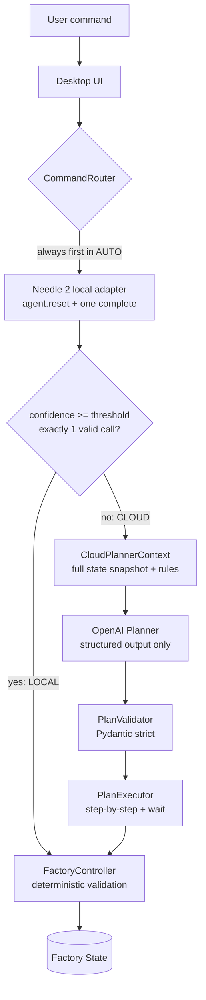

# Needle Factory Sim

**Edge AI hybrid control PoC** — a desktop factory simulation where a 14MB local
SLM (**Needle 2**) converts explicit natural-language commands into tool-call
candidates, a **Cloud LLM** (OpenAI) plans multi-step goal-oriented missions, and a
**deterministic FactoryController** is the only component allowed to change the
factory state — no matter which AI produced the command.


## Why Needle

Needle 2 (`cactus-needle`) is a tiny local model purpose-built for turning natural
language into constrained, schema-valid function calls — with a **calibrated
confidence score** per response. That makes it a natural edge-side gatekeeper:

- Explicit single commands ("Set sector A temperature to 30 degrees") are handled
  fully on-device: ~0.1 s latency, ~350 tok/s decode, ~55 MB RAM, no network.
- Goal-oriented requests that require knowing the whole factory state produce low
  confidence or no call — a measurable, honest signal to escalate to the cloud.

## Architecture



### Local vs Cloud roles

| | Local (Needle 2) | Cloud (OpenAI) |
|---|---|---|
| Sees | Only the user's sentence | Full factory snapshot + explicit rules |
| Produces | Exactly one tool-call **candidate** | A structured **ExecutionPlan** (max 8 steps, `wait` allowed) |
| Executes tools | Never (`agent.run()` is not used) | Never (no tool-calling agent) |
| Escalation | confidence < threshold, 0 or 2+ calls, error → Cloud | — |

### FactoryController safety boundary

Neither AI mutates state. Every action — local candidate or cloud plan step — is
re-validated against the **live** state at execution time: adjacency, target
temperature safety, door state, contamination rules, mission status. A rejected
action changes nothing (`state_changed = false`). *A valid AI tool call is not
the same thing as a valid physical action* — Demo B shows this on screen.

## Requirements

- Windows 11 x64 (primary target; the code is plain PySide6/Python)
- Python 3.11+
- [`uv`](https://docs.astral.sh/uv/) (`python -m pip install uv` works)
- Internet **once**, for dependency install and the first Needle engine/model
  provisioning (cached under `~/.cache/cactus-needle` / HuggingFace cache).
  After that, local inference runs fully offline.

## Download (Windows installer)

Grab `NeedleFactorySim-Setup-<version>.exe` from the
[Releases](https://github.com/sinbumu/needle-factory-sim/releases) page.
It installs per-user (no admin rights needed) and adds a Start Menu entry.

> The installer is not code-signed, so Windows SmartScreen will warn about an
> unknown publisher — choose **More info → Run anyway**.

The installer does not bundle the Needle engine/model; the app downloads them
to `~/.cache/cactus-needle` on first launch (internet needed once), then local
inference runs offline.

To rebuild the installer yourself: `scripts/build_installer.ps1`
(PyInstaller onedir via [packaging/NeedleFactorySim.spec](packaging/NeedleFactorySim.spec),
then Inno Setup via [packaging/installer.iss](packaging/installer.iss)).

## Installation & Run (from source)

```bash
uv sync
uv run python -m needle_factory_sim
```

or on Windows just double-click:

```text
run.bat
```

The first `Needle(...)` initialization downloads the engine + base model; the UI
shows `Needle: INITIALIZING...` → `READY (local inference available)`.
Engine binaries are never committed to this repository.

## Cloud Settings (session-only API key)

`Cloud Settings` opens a dialog with **Provider (OpenAI, fixed)**, **API Key**
(password-masked), **Model ID** (your choice, e.g. `gpt-4.1`) and the
**Confidence Threshold** (default 0.75).

- The API key lives **only in process memory** — never written to `.env`, config
  files, registry, logs, or the monitor, and it is gone when the app exits.
- `Reset Simulation` keeps the key/model/threshold; restarting the app does not.
- The monitor only ever shows `Cloud: Configured` / `Cloud: Not configured`.

Routing modes: `AUTO` (Needle first, escalate on low confidence), `FORCE LOCAL`
(no cloud escalation), `FORCE CLOUD` (skips Needle; the monitor shows
`OVERRIDE = TRUE` so it can't be mistaken for an AUTO result).

## Demos

Demo buttons reset the simulation and prefill the prompt; press **Execute**.
All three start from the identical initial state.

> The spec's original demo prompts are Korean. Spike measurement (3 runs each)
> showed the Needle 2 **base** model is unstable on Korean (confidence 0.00–0.21,
> wrong sector extraction), so per the plan's fallback rule the demo buttons use
> English prompts. Korean prompts are kept in `constants.DEMO_PROMPTS_KR` and can
> be typed manually — they will honestly route to CLOUD.

### Demo A — Local edge control
`Set sector A temperature to 30 degrees.` → Needle returns exactly one
`set_temperature(A, 30)` call at confidence **0.84** → routed LOCAL → controller
accepts → A's temperature glides 10 °C → 30 °C at 10 °C/s. The monitor shows real
TPS / RAM / latency telemetry.

### Demo B — Safety guard
`Move the robot directly to sector E.` → Needle confidently (0.95) produces
`move_robot(E)` — a perfectly valid **tool call** — but E is not adjacent to S,
so the controller rejects it: `REJECTED (NOT_ADJACENT)`, state unchanged.

### Demo C — Hybrid cloud planning
The goal-oriented transport request gives Needle nothing explicit to extract; it
errors/returns no call (confidence 0.00) → AUTO escalates to CLOUD. The planner
receives the full snapshot + rules and returns a strict `ExecutionPlan`
(typically: warm A, cool B, wait, open B's door, move S→A→B→E). The PlanExecutor
runs it step-by-step — each step re-validated by the controller, `wait` handled
by cancellable timers while temperatures keep transitioning and the UI stays
responsive. Without a configured key it shows `CLOUD FALLBACK REQUIRED` and
changes nothing.

**Live Cloud call requires a user-provided API key and model ID.** The cloud
adapter, plan schema, validation and execution paths are fully implemented and
verified with fixture plans; no fake keys or canned AI responses exist in the code.

## Tests

```bash
uv run pytest
```

42 tests cover the controller rules (adjacency, unsafe temperature, door,
contamination/reset, damage, game-over, e-stop), the confidence router (mocked
Needle responses), strict ExecutionPlan validation (step/wait limits, order
contiguity, extra-field rejection) and simulation reset. No test needs network
or a real cloud key. `scripts/needle_spike.py` measures real Needle behaviour;
`scripts/demo_smoke.py` drives Demo A/B/C end-to-end through the real window.

## Known limitations

- The Needle 2 base model handles Korean poorly (measured, see above) — demo
  prompts default to English; UI labels are unaffected. Fine-tuning is out of scope.
- Live cloud planning was implemented and validated against fixture plans and
  strict schema tests, but not exercised against the live OpenAI API in this
  environment (no key available).
- One plan at a time (single-flight); no rollback of already-succeeded steps —
  a failed step skips the remainder and reports honestly.
- OpenAI is the only cloud provider; the model ID is user-supplied, nothing is
  hardcoded.

## Release

v0.1.0 — initial PoC release. See the Git tag `v0.1.0`.
