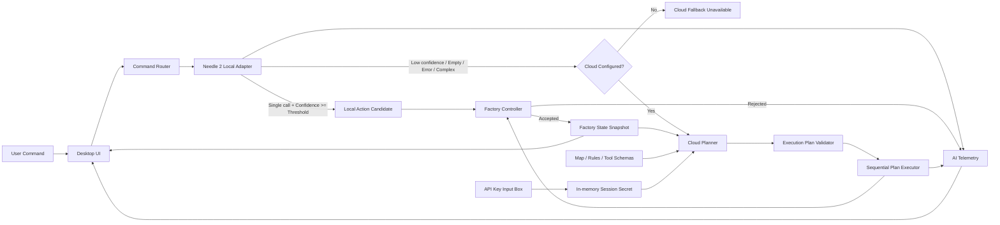

# [프로젝트 기획서 v0.2] Needle Factory Sim

> **프로젝트명:** `needle-factory-sim`  
> **저장소:** https://github.com/sinbumu/needle-factory-sim  
> **목적:** 격주 역량 개발의 날에 3~4시간 안에 기획·설계·개발·GitHub Release까지 완료하는 RKS 공유용 Edge AI 토이 프로젝트  
> **문서 상태:** 코딩 에이전트 지시서 작성 전 Scope Freeze 후보  
> **작성일:** 2026-08-28

---

## 0. v0.2에서 확정한 핵심 변경사항

1. 프로젝트의 우선순위를 **AI 기술 데모 70 / 게임 30**으로 고정한다.
2. Needle은 단순하고 명시적인 단일 제어 명령을 처리하는 **Local Command Compiler**로 사용한다.
3. Cloud LLM은 전체 공장 상태를 바탕으로 여러 함수의 호출 순서와 대기 시간을 결정하는 **Cloud Planner**로 사용한다.
4. AI가 반환한 명령은 Local/Cloud 구분 없이 반드시 결정론적 `FactoryController`의 검증을 통과해야 실행한다.
5. 불가능하거나 위험한 명령은 게임오버가 아니라 `REJECTED` 처리하고 상태를 변경하지 않는다.
6. 맵, 초기 온도, 안전 온도, 온도 변화율, Cargo HP 등 주요 게임 수치를 고정한다.
7. 기존 5개 Needle Tool은 유지하고, `wait`는 **Cloud Planner 전용 오케스트레이션 액션**으로 분리한다.
8. Cloud API Key는 환경변수나 파일로 받지 않는다. 앱의 설정 Input Box에서 사용자가 직접 입력하며, 프로세스 메모리에만 유지한다.
9. Cloud LLM에는 Tool 목록뿐 아니라 맵, 섹터, 온도, 문, 로봇, 화물, 전이 속도, 안전 규칙을 포함한 전체 상태 스냅샷을 전달한다.
10. 듀얼 OS 윈도우 대신 기본 구현은 **단일 데스크톱 창 + Factory/AI Monitor 분할 화면**으로 한다.
11. 시연 성공 기준을 Demo A, B, C 세 가지로 사전에 고정한다.
12. STT, Fine-tuning, 다중 스테이지, 다중 Cloud Provider 지원은 이번 버전의 범위에서 제외한다.

---

## 1. 프로젝트 정의

### 1.1. 한 문장 정의

**14MB Needle 2 모델을 로컬 자연어 제어기로 사용하여 실제 애플리케이션 상태를 Tool Calling으로 변경하고, 명시적 단일 명령은 Local SLM이 처리하며 추론·순서·시간 제어가 필요한 목표 지향 요청만 Cloud LLM이 계획하도록 하는 Edge AI 공장 관제 시뮬레이터.**

### 1.2. 프로젝트 목표

- Needle 2가 로컬에서 자연어를 구조화된 함수 호출로 변환하는 과정을 실제 UI로 시연한다.
- Needle의 Confidence Score를 이용해 Local 실행과 Cloud escalation을 분기한다.
- Cloud LLM이 현재 Factory State를 읽고 여러 Atomic Action으로 구성된 실행 계획을 생성하도록 한다.
- AI 출력과 실제 상태 변경 사이에 Safety Validation Layer를 두어, 잘못된 호출을 그대로 실행하지 않는 구조를 보여준다.
- AI 추론 경로, Confidence, Tool Call, Cloud Plan, 실행 결과를 실시간으로 시각화한다.
- 3~4시간 안에 실행 가능한 PoC와 `v0.1.0` GitHub Release를 만든다.

### 1.3. 핵심 메시지

> 명시적 명령은 14MB Edge SLM이 저지연으로 처리하고, 공장 전체 상태를 고려해야 하는 계획형 요청만 Cloud LLM으로 전달한다. 어느 모델이 명령을 만들더라도 실제 장치 상태 변경은 결정론적 Controller가 최종 검증한다.

### 1.4. 이번 프로젝트가 아닌 것

- 완성도 높은 퍼즐 게임
- 실제 산업 설비를 제어하는 시스템
- 장기 플레이용 다중 스테이지 게임
- 범용 AI Agent 프레임워크
- Cloud LLM이 애플리케이션 내부 함수를 직접 무제한 실행하는 구조
- Fine-tuning 성능 비교 프로젝트

---

## 2. 핵심 시연 시나리오

### 2.1. Demo A — Local Edge Control

### 사용자 입력

```text
A 구역 온도를 30도로 맞춰
```

### 기대 흐름

```text
User Input
  → Needle 2
  → confidence >= 0.75
  → LOCAL ROUTE
  → set_temperature(sector_id="A", target_c=30)
  → FactoryController 검증
  → 실행
```

### 화면에서 보여줄 내용

- Route: `LOCAL`
- Confidence: 예시 `0.94`
- Parsed Tool: `set_temperature`
- Arguments: `A`, `30°C`
- Prefill TPS / Decode TPS / Peak RAM
- A 섹터 색상이 Cold에서 Safe로 서서히 전환

### 시연 목적

- 작은 On-device Model이 명시적인 장치 제어 명령을 구조화된 함수 호출로 변환함을 보여준다.
- 온도는 즉시 변경되지 않고 시뮬레이션 규칙에 따라 전이된다.

---

### 2.2. Demo B — Deterministic Safety Guard

### 사용자 입력

```text
E 구역으로 바로 이동해
```

### 기대 흐름

```text
User Input
  → Needle 2
  → move_robot(target_sector="E")
  → LOCAL ROUTE
  → FactoryController 검증 실패
  → REJECTED
```

### 거부 이유

- 현재 로봇은 `S`에 있고 `E`는 인접 섹터가 아니다.
- AI가 올바른 JSON Tool Call을 만들었더라도 물리 규칙상 실행할 수 없다.

### 화면에서 보여줄 내용

```text
COMMAND REJECTED
Reason: Sector E is not adjacent to current sector S.
State changed: false
```

### 시연 목적

- AI 출력을 곧바로 actuator에 연결하지 않음을 보여준다.
- 모델의 추론 정확성과 시스템의 실행 안전성을 분리한다.

---

### 2.3. Demo C — Cloud Planning with Ordered Actions

### 사용자 입력

```text
현재 공장 상태를 고려해서 화물이 손상되지 않도록 목적지까지 안전하게 운송해줘.
```

### Needle 단계

Needle에는 전체 Factory State를 제공하지 않고 5개의 단순 제어 Tool만 제공한다. 따라서 위 요청처럼 다음 정보가 직접 명시되지 않은 목표형 요청은 Local에서 완성된 실행 계획을 만들기 어렵다.

- 어느 경로를 사용할지
- 어느 섹터의 온도를 몇 도로 변경할지
- 온도 전이가 끝날 때까지 얼마나 기다릴지
- 어느 문을 열어야 하는지
- 어떤 순서로 로봇을 이동할지

아래 조건 중 하나에 해당하면 Cloud Planner로 escalation한다.

- Needle `confidence < 0.75`
- `function_calls`가 비어 있음
- Needle inference error 또는 malformed result
- Local 실행 후보가 단일 Atomic Action으로 정리되지 않음

### Cloud 단계

Cloud LLM에는 다음 정보를 포함한 `CloudPlannerContext`를 전달한다.

- 사용자의 원문 요청
- 로봇의 현재 위치
- 목적지
- Cargo HP와 안전 온도 범위
- 모든 섹터의 현재 온도와 목표 온도
- 섹터별 상태: Start, Goal, Wall, Door, Contaminated 등
- 인접 관계와 이동 가능 경로
- 문 개폐 상태
- 온도 변화율
- 실행 가능한 5개 제어 Action
- Cloud 전용 `wait` Action
- 계획 최대 단계 수와 각 argument 제한
- 실행 시 적용되는 Safety Rule

Cloud LLM은 함수를 직접 실행하지 않고, 다음과 같은 **순서가 보장된 Execution Plan JSON**을 반환한다.

### 기대 계획 예시

초기 상태에서 A는 `10°C`, B는 `55°C`, 두 섹터 모두 진입하기에 위험하다. 온도 변화율은 초당 `10°C`이고 B의 Entry Door는 닫혀 있다.

```json
{
  "status": "ready",
  "summary": "A와 B의 온도를 병렬로 안전 범위에 맞춘 뒤 B의 문을 열고 목적지까지 이동합니다.",
  "steps": [
    {
      "order": 1,
      "action": "set_temperature",
      "arguments": {
        "sector_id": "A",
        "target_c": 30
      },
      "reason": "A는 현재 10°C로 화물 안전 범위보다 낮습니다."
    },
    {
      "order": 2,
      "action": "set_temperature",
      "arguments": {
        "sector_id": "B",
        "target_c": 30
      },
      "reason": "B는 현재 55°C로 화물 안전 범위보다 높습니다."
    },
    {
      "order": 3,
      "action": "wait",
      "arguments": {
        "seconds": 3
      },
      "reason": "A와 B가 동시에 온도 전이를 수행하며, 더 오래 걸리는 B가 안전 온도에 도달할 때까지 기다립니다."
    },
    {
      "order": 4,
      "action": "toggle_door",
      "arguments": {
        "sector_id": "B",
        "open": true
      },
      "reason": "B 진입 전에 Entry Door를 열어야 합니다."
    },
    {
      "order": 5,
      "action": "move_robot",
      "arguments": {
        "target_sector": "A"
      },
      "reason": "S에서 A로 이동합니다."
    },
    {
      "order": 6,
      "action": "move_robot",
      "arguments": {
        "target_sector": "B"
      },
      "reason": "안전 온도에 도달하고 문이 열린 B로 이동합니다."
    },
    {
      "order": 7,
      "action": "move_robot",
      "arguments": {
        "target_sector": "E"
      },
      "reason": "B에서 목적지 E로 이동합니다."
    }
  ]
}
```

### 실행 방식

1. Cloud 응답을 Pydantic/JSON Schema로 파싱한다.
2. 허용된 Action과 argument인지 검증한다.
3. 최대 단계 수, 대기 시간, 온도 범위 등을 검증한다.
4. `PlanExecutor`가 `order` 순서대로 하나씩 실행한다.
5. `set_temperature`는 목표 온도만 설정하고 즉시 다음 단계로 넘어간다.
6. `wait`는 UI Thread를 멈추지 않는 비동기 타이머로 동작한다.
7. `wait` 동안 섹터의 온도 전이는 계속 진행된다.
8. 대기가 끝난 뒤에만 다음 Action을 실행한다.
9. 각 Action 직전에 최신 Factory State를 기준으로 다시 검증한다.
10. 한 단계라도 실패하면 남은 계획은 중단한다.
11. 이미 적용된 이전 단계는 자동 롤백하지 않는다.

### 시연 목적

- Cloud LLM이 단순 Tool Selection이 아니라 전체 상태를 기반으로 순서·대기·이동을 계획함을 보여준다.
- `wait`를 명시적 Action으로 모델링하여 “누가 언제 다음 함수를 실행하는가”를 Plan Executor의 책임으로 고정한다.
- 계획과 실행을 분리하고, 실행 시점에 최신 상태를 다시 검증하는 구조를 보여준다.

---

## 3. 전체 아키텍처



### 3.1. 컴포넌트 책임

| 컴포넌트 | 책임 |
|---|---|
| `Desktop UI` | Factory 시각화, 자연어 입력, Command Chip, 설정, 실행 로그 표시 |
| `CommandRouter` | Needle 결과와 Confidence를 평가하고 Local/Cloud 경로를 결정 |
| `NeedleAdapter` | 5개 Tool Schema를 Needle에 등록하고 raw response/telemetry 반환 |
| `CloudPlanner` | 전체 Factory Context와 사용자 목표를 받아 Execution Plan 생성 |
| `PlanValidator` | Cloud 응답의 JSON 구조, Action whitelist, argument 범위 검증 |
| `PlanExecutor` | 계획을 순서대로 실행하며 `wait`와 취소 상태 관리 |
| `FactoryController` | 모든 상태 변경 전 물리·안전·게임 규칙 검증 |
| `FactoryStateStore` | 로봇, 화물, 섹터, 문, 온도, lock, emergency 상태 보관 |
| `SimulationClock` | 온도 전이와 Cargo HP 감소를 일정 tick으로 처리 |
| `AI Telemetry` | Local inference, Cloud plan, validation, execution 결과를 UI에 전달 |

### 3.2. 핵심 설계 원칙

- AI는 상태 변경을 **제안**한다.
- Controller만 상태 변경을 **승인·실행**한다.
- Cloud는 실행 주체가 아니라 **계획 생성자**이다.
- `wait`를 포함한 계획의 순차 실행 주체는 `PlanExecutor`이다.
- UI Thread에서 AI inference/API 호출/대기 시간을 직접 block하지 않는다.
- Local과 Cloud는 동일한 `FactoryController`를 사용한다.

---

## 4. 권장 기술 스택

### 4.1. MVP 고정안

| 영역 | 선택 |
|---|---|
| Language | Python 3.11 권장 |
| Desktop UI | PySide6 |
| Local AI | `cactus-needle` / Needle 2 Base Model |
| Data Model / Validation | Pydantic |
| Cloud Adapter | OpenAI API 단일 Adapter |
| Cloud Model | 앱 설정 화면에서 사용자가 Model ID 입력 |
| Async UI 처리 | Qt Worker Thread 또는 `QThread` + Signal |
| `wait` 처리 | `QTimer` 또는 asyncio-compatible non-blocking timer |
| Package 관리 | `pyproject.toml` + `uv` 또는 `pip` 중 하나로 통일 |
| Test | `pytest` 기반 Controller/PlanValidator 단위 테스트 |
| Release | GitHub `v0.1.0` Release, 소스/실행 스크립트 필수 |

### 4.2. 선택 이유

- Needle의 공식 Python API를 가장 직접적으로 사용할 수 있다.
- PySide6는 별도 Web Server 없이 단일 데스크톱 관제 화면을 빠르게 구성할 수 있다.
- Factory State와 Cloud Plan을 Pydantic 모델로 정의하면 코딩 에이전트가 구현 계약을 명확히 지킬 수 있다.
- Cloud Provider를 여러 개 지원하지 않고, MVP에서는 OpenAI Adapter 하나만 구현해 범위를 제한한다.
- Cloud Model 이름은 코드에 고정하지 않고 사용자 입력으로 받는다.

### 4.3. Stretch Goal

- PyInstaller 기반 Windows 실행 파일 또는 압축 배포본
- AI Monitor Pop-out Window
- Cloud Provider Adapter 추가
- Scenario Replay 또는 로그 Export

---

## 5. Factory Map 및 초기 상태

### 5.1. 고정 맵

```text
┌─────────┬─────────┬─────────┐
│ S       │ A       │ B       │
│ Start   │ Cold    │ Hot     │
│ 30°C    │ 10°C    │ 55°C    │
├─────────┼─────────┼─────────┤
│ X       │ C       │ E       │
│ Wall    │ Hazard  │ Goal    │
│         │ 50°C    │ 30°C    │
└─────────┴─────────┴─────────┘
```

### 5.2. 인접 관계

```text
S <-> A
A <-> B
A <-> C
B <-> E
C <-> E
```

- `X`는 Wall이며 진입할 수 없다.
- 이동은 상하좌우 인접 관계로 정의된 한 칸만 가능하다.
- 대각선 이동은 불가능하다.

### 5.3. 섹터 정의

| Sector | 초기 온도 | 초기 상태 | 특수 규칙 |
|---|---:|---|---|
| `S` | 30°C | Safe / Start | 로봇 초기 위치 |
| `A` | 10°C | Cold | 진입 전 온도 조정 필요 |
| `B` | 55°C | Hot / Door Closed | 진입 전 안전 온도와 Door Open 필요 |
| `C` | 50°C | Hot / Contaminated | 사용 후 `reset_sector(C)` 필요 |
| `E` | 30°C | Safe / Goal | 최종 목적지 |
| `X` | N/A | Wall | 모든 이동 거부 |

### 5.4. Door 모델

- Door는 섹터에 진입하기 위한 Entry Gate로 단순화한다.
- MVP에서는 `B`에만 Door가 있다.
- `B`로 이동하려면 `B.door_open == true`여야 한다.
- Door Open/Close 자체에는 별도 시간이 들지 않는다.

---

## 6. 게임 및 시뮬레이션 규칙

### 6.1. 온도 상태

| 상태 | 범위 |
|---|---:|
| Cold | `< 20°C` |
| Safe | `20°C ~ 40°C` |
| Hot | `> 40°C` |

### 6.2. 온도 전이

- `set_temperature`는 현재 온도를 즉시 변경하지 않고 `target_temperature`를 변경한다.
- 현재 온도는 초당 `10°C` 속도로 목표 온도를 향해 이동한다.
- 여러 섹터는 동시에 온도 전이를 수행할 수 있다.
- UI는 현재 온도와 목표 온도를 모두 표시한다.
- 색상은 현재 온도를 기준으로 Cold/Safe/Hot 상태를 표현한다.

### 6.3. Cargo

| 항목 | 값 |
|---|---:|
| 초기 HP | 100 |
| 안전 온도 밖의 HP 감소 | 초당 10 |
| 승리 조건 | Robot이 E에 도착하고 Cargo HP > 0 |
| 패배 조건 | Cargo HP가 0에 도달 |

- Cargo는 로봇이 위치한 섹터의 현재 온도 영향을 받는다.
- 이동 명령 시 목적지 섹터가 Safe가 아니면 Controller가 이동을 거부한다.
- 이동이 거부되었을 때 Cargo HP는 즉시 감소하지 않는다.

### 6.4. Contaminated Sector

- `C`에 진입하면 `C.used = true`가 된다.
- 로봇이 C를 떠나면 `C.needs_reset = true`가 된다.
- 목적지에 도착하더라도 `needs_reset` 상태가 남아 있으면 완전한 Mission Success가 아니라 `GOAL REACHED / CLEANUP REQUIRED` 상태로 표시한다.
- `reset_sector(C)`는 로봇이 C 밖에 있을 때만 성공한다.
- `reset_sector(C)` 성공 후 `needs_reset = false`가 된다.
- Demo A/B/C의 기본 시나리오는 B 경로를 사용하므로 Reset은 별도 보조 시연용이다.

### 6.5. Emergency Stop

- `emergency_stop` 실행 시 Simulation 상태를 `EMERGENCY_STOPPED`로 변경한다.
- 진행 중인 Cloud Plan과 `wait` 타이머를 즉시 취소한다.
- 이후 AI 명령은 거부한다.
- 재개는 AI Tool이 아니라 UI의 `Reset Simulation` 버튼으로만 가능하게 한다.

---

## 7. Local Needle Tool 계약

Needle에 등록하는 Tool은 정확히 아래 5개로 제한한다.

> Needle 공식 문서상 5개 이하 Tool은 모두 직접 컨텍스트에 포함되고, 5개를 초과하면 Tool Retrieval이 동작한다. 이번 PoC는 데모 예측 가능성을 위해 Local Tool을 5개로 유지한다.

### 7.1. `move_robot`

```text
move_robot(target_sector)
```

| Argument | Type | Constraint |
|---|---|---|
| `target_sector` | Enum | `S`, `A`, `B`, `C`, `E` |

### Controller 검증

- Emergency Stop 상태가 아닌가
- 현재 위치와 target이 인접한가
- target이 Wall이 아닌가
- target의 현재 온도가 Safe인가
- target이 B이면 Door가 열려 있는가
- Cargo HP가 0보다 큰가

### 결과 예시

```json
{
  "accepted": true,
  "from": "S",
  "to": "A"
}
```

또는

```json
{
  "accepted": false,
  "error_code": "NOT_ADJACENT",
  "message": "Sector E is not adjacent to current sector S."
}
```

### 7.2. `set_temperature`

```text
set_temperature(sector_id, target_c)
```

| Argument | Type | Constraint |
|---|---|---|
| `sector_id` | Enum | `S`, `A`, `B`, `C`, `E` |
| `target_c` | Integer | `0 ~ 60` |

### 동작

- `current_temperature`를 즉시 바꾸지 않는다.
- `target_temperature`만 갱신한다.
- 온도 전이는 Simulation Clock이 처리한다.

### 7.3. `toggle_door`

```text
toggle_door(sector_id, open)
```

| Argument | Type | Constraint |
|---|---|---|
| `sector_id` | Enum | `B` |
| `open` | Boolean | `true` 또는 `false` |

### Controller 검증

- B 이외의 섹터는 Schema 단계에서 허용하지 않는다.
- Emergency Stop 상태에서는 거부한다.

### 7.4. `reset_sector`

```text
reset_sector(sector_id)
```

| Argument | Type | Constraint |
|---|---|---|
| `sector_id` | Enum | `C` |

### Controller 검증

- C가 `needs_reset == true`인가
- Robot이 현재 C 밖에 있는가
- Emergency Stop 상태가 아닌가

### 7.5. `emergency_stop`

```text
emergency_stop()
```

- argument 없음
- Controller 검증 없이 최우선으로 처리한다.
- 진행 중 Plan Queue와 Timer를 취소한다.

---

## 8. Cloud 전용 `wait` Action

`wait`는 Factory 장치를 직접 제어하는 Needle Tool이 아니라, Cloud가 만든 계획을 순차 실행하기 위한 **오케스트레이션 Primitive**이다.

```text
wait(seconds)
```

| Argument | Type | Constraint |
|---|---|---|
| `seconds` | Integer | `1 ~ 10` |

### 8.1. 동작 의미

- `PlanExecutor`가 지정된 시간 동안 다음 단계 실행을 보류한다.
- UI Thread는 block하지 않는다.
- Simulation Clock은 계속 진행된다.
- 모든 섹터의 온도 전이와 현재 섹터의 Cargo HP 계산은 계속된다.
- 타이머가 완료되면 다음 단계로 진행한다.
- 사용자가 Emergency Stop 또는 Reset을 누르면 즉시 취소된다.

### 8.2. 안전 제한

- 하나의 Plan은 최대 8단계이다.
- 한 번의 `wait`는 최대 10초이다.
- 한 Plan의 누적 `wait`는 최대 15초이다.
- 음수, 0, 비정상적으로 긴 대기는 Plan Validation 단계에서 거부한다.

### 8.3. 왜 Needle에 노출하지 않는가

- Local은 명시적인 단일 Atomic Action에 집중한다.
- 시간·서순을 포함하는 요청은 Cloud Planner의 역할로 명확히 분리한다.
- Needle Tool을 5개로 유지하여 Tool Retrieval이 개입하지 않게 한다.
- `wait`의 실행 주체를 AI가 아니라 Plan Executor로 고정한다.

---

## 9. Routing 규칙

### 9.1. 기본 모드

UI의 기본 Routing Mode는 `AUTO`이다.

```text
AUTO
  → 항상 Needle을 먼저 호출
  → Needle 결과 평가
  → Local 또는 Cloud 결정
```

### 9.2. Local Route 조건

아래 조건을 모두 만족하면 Local Candidate로 처리한다.

- Needle 응답이 성공
- `confidence`가 숫자로 존재
- `confidence >= 0.75`
- `function_calls`가 정확히 1개
- Action이 Local Tool whitelist에 포함
- argument가 Tool Schema에 부합

그 후 FactoryController의 검증을 통과해야 실제 실행된다.

### 9.3. Cloud Route 조건

아래 조건 중 하나라도 만족하면 Cloud Planner로 전달한다.

- `confidence < 0.75`
- `confidence is None`
- `function_calls == []`
- `function_calls`가 2개 이상
- Needle inference error
- Needle 응답 구조가 예상 계약과 다름

### 9.4. Cloud 미설정 상태

Cloud Route가 필요하지만 API Key 또는 Model ID가 입력되지 않은 경우:

```text
CLOUD FALLBACK REQUIRED
Cloud provider is not configured.
Open Settings and enter an API key and model ID.
```

- Local에서 임의로 실행하지 않는다.
- Factory State를 변경하지 않는다.
- 사용자의 원문 입력은 Input Box에 유지하여 설정 후 재실행할 수 있게 한다.

### 9.5. 디버그용 Route Override

시연 안정성과 테스트를 위해 AI Monitor에 다음 선택지를 둘 수 있다.

- `AUTO` — 기본, Confidence 기반
- `FORCE LOCAL` — Needle 결과만 사용
- `FORCE CLOUD` — Needle 결과와 무관하게 Cloud Planner 호출

단, 화면에 `OVERRIDE` 상태를 명확히 표시해 자동 라우팅 결과로 오해하지 않게 한다. 이 기능은 SHOULD 범위이다.

---

## 10. Cloud API Key 및 설정 UX

### 10.1. 입력 방식

환경변수, `.env`, 설정 파일을 사용하지 않는다.

앱의 `Cloud Settings` Dialog에 다음 Input을 제공한다.

| Field | 처리 방식 |
|---|---|
| Provider | MVP에서는 `OpenAI` 고정 표시 |
| API Key | Password Masked Input |
| Model ID | 사용자가 직접 입력 |
| Confidence Threshold | 기본값 `0.75`, 선택적으로 수정 가능 |

### 10.2. 저장 정책

- API Key는 사용자가 `Apply for this session`을 누른 뒤 프로세스 메모리에만 저장한다.
- 앱 종료 시 자동 폐기한다.
- 파일, 레지스트리, 로그, crash report에 저장하지 않는다.
- AI Monitor에는 Key 값을 표시하지 않는다.
- 설정 여부만 `Cloud: Configured / Not configured`로 표시한다.
- Model ID와 Threshold도 MVP에서는 세션 동안만 유지한다.
- API Key를 지우는 `Clear Key` 버튼을 제공한다.

### 10.3. 오류 처리

| 오류 | 처리 |
|---|---|
| 401/403 | Key 또는 권한 오류 표시, 계획 실행 안 함 |
| 429 | Rate Limit 표시, 계획 실행 안 함 |
| Network Error | Cloud 요청 실패 표시, 상태 변경 없음 |
| Timeout | 요청 중단, 상태 변경 없음 |
| Invalid JSON | Plan Validation 실패, 상태 변경 없음 |
| Unsupported Model | Model ID 확인 안내 |

### 10.4. 로그 보안

다음 정보만 로그에 남긴다.

- Provider
- Model ID
- 요청 시작/종료 시각
- 응답 시간
- Plan Step 수
- Validation 결과

다음 정보는 로그에 남기지 않는다.

- API Key
- Authorization Header
- Cloud SDK의 raw request 객체

---

## 11. Cloud Planner Context 계약

Cloud 요청은 일반 대화형 Prompt가 아니라, 아래와 같이 명확한 역할과 구조를 가진다.

### 11.1. System Contract

```text
You are a deterministic planning component for a factory simulation.
You do not execute tools.
Return one ExecutionPlan JSON object that conforms to the provided schema.
Use only the listed actions.
Use the current factory state and rules; do not invent hidden sectors, paths, doors, or values.
All actions execute sequentially in the listed order.
set_temperature starts a gradual transition and returns immediately.
Temperature transitions for different sectors continue concurrently.
Use wait when time must pass before a later action becomes safe.
Prefer a safe plan over a short plan.
Do not move the robot into a sector whose current temperature will be outside the cargo safe range at execution time.
If no safe plan exists, return status=cannot_plan with no steps.
```

### 11.2. `CloudPlannerContext` 예시

```json
{
  "request_id": "uuid",
  "user_request": "현재 공장 상태를 고려해서 화물이 손상되지 않도록 목적지까지 안전하게 운송해줘.",
  "goal": {
    "destination_sector": "E",
    "cargo_must_survive": true
  },
  "robot": {
    "current_sector": "S",
    "status": "IDLE"
  },
  "cargo": {
    "hp": 100,
    "safe_temperature_c": {
      "min": 20,
      "max": 40
    },
    "damage_per_second_outside_safe_range": 10
  },
  "simulation": {
    "temperature_change_rate_c_per_second": 10,
    "actions_execute_sequentially": true,
    "temperature_transitions_run_concurrently": true,
    "max_plan_steps": 8,
    "max_single_wait_seconds": 10,
    "max_total_wait_seconds": 15
  },
  "map": {
    "adjacency": {
      "S": ["A"],
      "A": ["S", "B", "C"],
      "B": ["A", "E"],
      "C": ["A", "E"],
      "E": ["B", "C"]
    },
    "walls": ["X"]
  },
  "sectors": [
    {
      "id": "S",
      "kind": "START",
      "current_temperature_c": 30,
      "target_temperature_c": 30,
      "temperature_status": "SAFE",
      "door_open": null,
      "needs_reset": false
    },
    {
      "id": "A",
      "kind": "NORMAL",
      "current_temperature_c": 10,
      "target_temperature_c": 10,
      "temperature_status": "COLD",
      "door_open": null,
      "needs_reset": false
    },
    {
      "id": "B",
      "kind": "DOOR",
      "current_temperature_c": 55,
      "target_temperature_c": 55,
      "temperature_status": "HOT",
      "door_open": false,
      "needs_reset": false
    },
    {
      "id": "C",
      "kind": "CONTAMINATED",
      "current_temperature_c": 50,
      "target_temperature_c": 50,
      "temperature_status": "HOT",
      "door_open": null,
      "needs_reset": false
    },
    {
      "id": "E",
      "kind": "GOAL",
      "current_temperature_c": 30,
      "target_temperature_c": 30,
      "temperature_status": "SAFE",
      "door_open": null,
      "needs_reset": false
    }
  ],
  "available_actions": [
    {
      "name": "move_robot",
      "arguments": {
        "target_sector": ["S", "A", "B", "C", "E"]
      }
    },
    {
      "name": "set_temperature",
      "arguments": {
        "sector_id": ["S", "A", "B", "C", "E"],
        "target_c": {
          "type": "integer",
          "minimum": 0,
          "maximum": 60
        }
      }
    },
    {
      "name": "toggle_door",
      "arguments": {
        "sector_id": ["B"],
        "open": {
          "type": "boolean"
        }
      }
    },
    {
      "name": "reset_sector",
      "arguments": {
        "sector_id": ["C"]
      }
    },
    {
      "name": "emergency_stop",
      "arguments": {}
    },
    {
      "name": "wait",
      "arguments": {
        "seconds": {
          "type": "integer",
          "minimum": 1,
          "maximum": 10
        }
      }
    }
  ]
}
```

### 11.3. 컨텍스트 생성 시점

- Cloud 요청 버튼을 누른 시점의 Factory State를 직렬화한다.
- API 응답을 기다리는 동안 Simulation State가 변할 수 있다.
- 따라서 Cloud Plan은 응답 직후 최신 상태를 기준으로 다시 검증한다.
- 계획 실행 중에도 각 Action 직전에 최신 상태를 재검증한다.
- 상태 변화로 계획이 더 이상 유효하지 않으면 남은 단계를 중단한다.

---

## 12. Cloud Execution Plan Schema

```json
{
  "status": "ready",
  "summary": "string",
  "steps": [
    {
      "order": 1,
      "action": "set_temperature",
      "arguments": {
        "sector_id": "A",
        "target_c": 30
      },
      "reason": "string"
    }
  ]
}
```

또는 계획 불가:

```json
{
  "status": "cannot_plan",
  "summary": "No safe route is available from the current state.",
  "steps": []
}
```

### 12.1. Validation 규칙

- Root object가 존재해야 한다.
- `status`는 `ready` 또는 `cannot_plan`이다.
- `ready`이면 `steps`가 1개 이상이어야 한다.
- `cannot_plan`이면 `steps`는 빈 배열이어야 한다.
- `order`는 1부터 시작하며 중복이나 누락 없이 증가해야 한다.
- Action은 whitelist에 포함되어야 한다.
- 각 Action의 arguments는 정의된 Schema를 만족해야 한다.
- 단계 수는 8 이하이다.
- 누적 wait는 15초 이하이다.
- `emergency_stop`이 포함된 경우 해당 단계 이후 다른 Action이 존재할 수 없다.
- 알 수 없는 extra field는 무시하지 않고 Validation Error로 처리하는 것을 권장한다.

### 12.2. 실행 상태

각 Step은 다음 상태를 가진다.

```text
PENDING
RUNNING
WAITING
SUCCEEDED
FAILED
CANCELLED
SKIPPED
```

### 12.3. 실패 정책

- 한 단계 실패 시 이후 단계는 `SKIPPED` 처리한다.
- 실패한 Action과 Controller의 `error_code`를 UI에 표시한다.
- 이미 성공한 단계는 되돌리지 않는다.
- 사용자는 상태를 확인한 뒤 새 명령을 입력하거나 Reset한다.

---

## 13. UI/UX 설계

### 13.1. 기본 레이아웃

```text
┌──────────────────────────────────────────────────────────────┐
│ Needle Factory Sim        [AUTO] [Cloud Settings] [Reset]   │
├───────────────────────────────────┬──────────────────────────┤
│                                   │ AI MONITOR               │
│          FACTORY VIEW             │                          │
│                                   │ Route: LOCAL / CLOUD     │
│     S ───── A ───── B             │ Confidence: 0.94         │
│             │       │             │ Tool / Plan              │
│             C ───── E             │ Validation / Execution   │
│                                   │ TPS / RAM / Latency      │
│ Cargo HP: 100                      │                          │
├───────────────────────────────────┴──────────────────────────┤
│ > 자연어 명령 입력                                            │
│ [SET TEMP] [MOVE] [OPEN] [A] [B] [C] [30°C]                 │
│ [Demo A] [Demo B] [Demo C]                                  │
└──────────────────────────────────────────────────────────────┘
```

### 13.2. Factory View

각 Sector Card에 다음을 표시한다.

- Sector ID
- 현재 온도
- 목표 온도
- Cold/Safe/Hot 상태
- Door Open/Closed
- Robot 위치
- Start/Goal/Wall/Contaminated 아이콘 또는 텍스트
- Reset Required 여부

색상:

- Cold: Blue 계열
- Safe: Green 계열
- Hot: Red 계열
- Wall: Gray
- 선택/실행 중: Border 또는 pulse animation

### 13.3. Command Input

- 자유 입력 Text Box
- Enter 또는 Execute 버튼으로 전송
- AI 처리 중 중복 입력 방지
- Command Chip은 문장을 Input Box에 조립하거나 예시 명령을 채운다.
- Demo A/B/C 버튼은 명령문을 자동 입력하되 즉시 실행하지는 않는다.

### 13.4. AI Monitor — Local

표시 항목:

```text
Input
Needle response type
Confidence
Threshold
Route decision
Function calls
Arguments
Reasoning
Prefill TPS
Decode TPS
Peak RAM MB
Inference latency
Controller result
```

### 13.5. AI Monitor — Cloud

표시 항목:

```text
Provider / Model ID
Request status
Cloud response latency
State snapshot timestamp
Plan summary
Ordered step list
Current step
Wait countdown
Validation result
Controller result per step
```

API Key는 표시하지 않는다.

### 13.6. 응답 로그 예시

```text
[09:43:21.120] INPUT
A 구역 온도를 30도로 맞춰

[09:43:21.448] NEEDLE
type=call confidence=0.94 threshold=0.75
route=LOCAL
call=set_temperature({"sector_id":"A","target_c":30})
peak_ram_mb=28.5 decode_tps=850.0

[09:43:21.451] CONTROLLER
ACCEPTED
A.target_temperature: 10 -> 30
```

Cloud Plan:

```text
[09:46:11.002] ROUTER
Needle confidence=0.41
route=CLOUD

[09:46:12.540] CLOUD PLAN
7 steps validated

[1/7] set_temperature(A, 30)      SUCCEEDED
[2/7] set_temperature(B, 30)      SUCCEEDED
[3/7] wait(3)                     WAITING 2.1s
[4/7] toggle_door(B, true)        PENDING
[5/7] move_robot(A)               PENDING
[6/7] move_robot(B)               PENDING
[7/7] move_robot(E)               PENDING
```

---

## 14. Scope 우선순위

### 14.1. MUST

- 실제 Needle 2 inference
- Needle 5개 Tool Schema
- Confidence 표시와 Local/Cloud Routing
- Factory State / Controller / Simulation Clock
- 고정 2×3 Map
- 온도 Transition
- Safe 이동 검증
- Demo A
- Demo B
- Cloud Settings의 API Key/Model Input
- CloudPlannerContext 생성
- 구조화된 Cloud Execution Plan
- `wait` 비동기 실행
- Demo C
- AI Monitor 기본 로그
- Reset / Emergency Stop
- README
- `v0.1.0` GitHub Release

### 14.2. SHOULD

- Command Chip UI
- Demo A/B/C Preset 버튼
- Cargo HP 감소 Animation
- Contaminated C / Reset 시나리오
- Route Override
- Controller/PlanValidator 핵심 단위 테스트
- Screenshot 또는 짧은 GIF

### 14.3. COULD

- AI Monitor 별도 Pop-out Window
- Windows 실행 파일
- Plan Replay
- 로그 JSON Export
- Cloud 연결 테스트 버튼
- 섹터 hover 상세 정보

### 14.4. WON'T — 이번 버전 제외

- STT
- Needle Fine-tuning
- 다중 맵/스테이지
- 사용자 계정 및 서버 저장
- API Key 영구 저장
- 환경변수 기반 API Key 주입
- Anthropic 등 다중 Cloud Provider
- 복수 Plan 동시 실행
- 부분 실패 자동 롤백
- 복잡한 경로 탐색 알고리즘
- 실제 IoT/PLC 연동
- Installer 제작 보장

---

## 15. 3~4시간 실행 계획

| 구간 | 목표 | 완료 조건 |
|---|---|---|
| 0:00~0:20 | Needle Go/No-Go Spike | 실제 Tool Call과 confidence 값을 터미널에서 확인 |
| 0:20~0:40 | 프로젝트 Skeleton | UI, State, Controller, Adapter 디렉토리와 실행 진입점 생성 |
| 0:40~1:25 | Factory Core | 맵, 온도 전이, 이동 검증, Reset/E-stop 동작 |
| 1:25~2:00 | Local AI | Needle Adapter, 5개 Tool, Router, Demo A/B |
| 2:00~2:45 | Cloud Planner | 설정 Dialog, Context, Plan Schema, OpenAI Adapter |
| 2:45~3:15 | Plan Executor | 순차 실행, wait timer, step 상태, Demo C |
| 3:15~3:35 | UI/로그 정리 | Monitor, Preset, 오류 메시지, 기본 polish |
| 3:35~4:00 | Release | README, screenshot, tag, GitHub Release |

### 15.1. Go/No-Go Spike 필수 검증

UI 개발 전에 다음을 먼저 실행한다.

```text
1. cactus-needle 설치
2. Tool 1개 등록
3. 명시적 영어 명령 테스트
4. 명시적 한국어 명령 테스트
5. function_calls / confidence / peak_ram_mb 확인
```

### 15.2. 한국어 처리 리스크 대응

Needle의 한국어 명령 처리 품질이 시연에 충분한지는 초반 Spike로 확인한다.

- 한국어가 안정적이면 모든 Demo를 한국어로 진행한다.
- 한국어 confidence 또는 argument parsing이 불안정하면 다음 대안을 적용한다.
  - Command Chip이 영어 명령을 생성하도록 한다.
  - UI 라벨과 설명은 한국어로 유지한다.
  - Demo Input을 영어/한국어 병기로 제공한다.
- 이 대안은 모델 성능을 숨기기 위한 것이 아니라 제한된 시간 내에 Edge Tool Calling 구조를 안정적으로 시연하기 위한 fallback이다.

---

## 16. Definition of Done

프로젝트는 다음 조건을 모두 만족하면 완료로 본다.

### 16.1. 기능

- 앱이 데스크톱 창으로 실행된다.
- Factory Map과 모든 Sector 상태가 보인다.
- Needle이 실제로 로컬 inference를 수행한다.
- Local 응답에서 confidence와 Tool Call을 표시한다.
- Demo A가 Local Route로 실행된다.
- Demo B가 Controller에 의해 거부된다.
- Cloud API Key와 Model ID를 앱 Input Box로 입력할 수 있다.
- API Key는 앱 종료 후 남지 않는다.
- Demo C가 Cloud Plan을 생성한다.
- Cloud Plan이 순차적으로 실행된다.
- `wait` 동안 UI가 멈추지 않고 온도가 전이된다.
- 각 단계의 상태가 Monitor에 표시된다.
- 잘못된 Plan이나 Action은 상태 변경 없이 거부된다.
- Emergency Stop이 실행 Queue와 wait를 취소한다.

### 16.2. 저장소

- 실행 방법이 README에 있다.
- Cloud API Key를 코드/문서/로그에 포함하지 않는다.
- `.gitignore`가 캐시, 가상환경, 빌드 산출물을 제외한다.
- Architecture와 Demo A/B/C 설명이 README에 있다.
- 최소 1개의 Screenshot 또는 GIF가 있다.
- `v0.1.0` Tag와 GitHub Release가 존재한다.
- Release Notes에 구현 범위와 알려진 제한사항을 기록한다.

### 16.3. 배포 형태

MUST:

- GitHub Release
- Source archive
- `pyproject.toml`
- Windows 실행 절차
- `run.bat` 또는 동등한 실행 스크립트

Stretch:

- PyInstaller 기반 실행 파일 또는 Portable ZIP

---

## 17. 수용 테스트

| ID | 입력/행동 | 기대 결과 |
|---|---|---|
| AT-01 | `A 구역 온도를 30도로 맞춰` | Local, `set_temperature(A,30)`, A 온도 전이 |
| AT-02 | `E 구역으로 바로 이동해` | Tool Call 후 Controller `NOT_ADJACENT` 거부 |
| AT-03 | Cloud 미설정 상태에서 목표형 요청 | `CLOUD_NOT_CONFIGURED`, 상태 변화 없음 |
| AT-04 | 잘못된 API Key 입력 후 Cloud 요청 | 인증 오류 표시, 상태 변화 없음 |
| AT-05 | Demo C 요청 | Cloud가 Context를 받고 구조화된 Plan 반환 |
| AT-06 | Demo C의 wait 실행 | 3초 동안 다음 단계 보류, 온도는 계속 전이 |
| AT-07 | wait 완료 후 이동 | A/B가 Safe이고 B Door가 열린 뒤 이동 |
| AT-08 | Cloud가 비인접 이동 계획 반환 | 해당 단계 FAILED, 이후 단계 SKIPPED |
| AT-09 | Plan 실행 중 Emergency Stop | Timer/Queue 취소, 상태 `EMERGENCY_STOPPED` |
| AT-10 | 앱 종료 후 재실행 | API Key가 남아 있지 않음 |
| AT-11 | C 사용 후 Reset | C 밖에서만 reset 성공 |
| AT-12 | Cargo HP 0 | GAME OVER, 추가 이동 거부 |

---

## 18. 주요 리스크와 대응

| 리스크 | 대응 |
|---|---|
| Needle 설치 또는 플랫폼 이슈 | 첫 20분 Go/No-Go Spike, UI보다 먼저 검증 |
| 한국어 명령 성능 불안정 | 영어/한국어 Preset과 Command Chip fallback |
| Needle 결과가 시연마다 달라짐 | Tool Schema를 Enum/Bound로 강하게 제한, Demo 문장 고정 |
| Demo C가 자동으로 Cloud로 가지 않음 | 목표형 문장을 사용하고 필요 시 FORCE CLOUD 디버그 옵션 제공 |
| Cloud가 잘못된 순서/argument 반환 | Strict Schema + PlanValidator + 실행 직전 Controller 재검증 |
| wait 시간이 부족함 | 이동 시점의 실제 온도가 Safe가 아니면 이동 거부 및 Plan 중단 |
| Cloud API Latency | Monitor에 Planning 상태와 latency 표시, UI 비동기 처리 |
| API Key 노출 | 메모리 전용 보관, masked input, 로그 제외 |
| PyInstaller 패키징 지연 | 실행 스크립트와 GitHub Release를 필수 완료 조건으로 유지 |
| 범위 과다 | MUST부터 구현하고 C/Reset polish보다 Release를 우선 |

---

## 19. 구현 시 반드시 유지할 경계

### 19.1. Needle과 Cloud의 역할 분리

| Local Needle | Cloud Planner |
|---|---|
| 단일 명시적 장치 명령 | 목표 지향·복합·추상 요청 |
| Factory 전체 상태를 모름 | Factory 전체 상태 스냅샷을 받음 |
| 5개 Atomic Tool만 인식 | 5개 Tool + wait로 계획 생성 |
| Confidence로 실행 후보 판정 | 순서가 있는 Execution Plan 반환 |
| 직접 Controller 호출 후보 | 직접 실행하지 않고 Plan만 생성 |

### 19.2. AI와 Controller의 역할 분리

```text
AI Output != State Mutation
AI Output → Validation → Controller → State Mutation
```

### 19.3. 계획과 실행의 역할 분리

```text
Cloud LLM
  → 어떤 Action을 어떤 순서로 호출할지 결정

PlanExecutor
  → 순서, wait, 취소, step 상태를 관리

FactoryController
  → 각 Action이 현재 상태에서 실제 실행 가능한지 검증
```

---

## 20. 이후 코딩 에이전트 지시서에서 추가로 고정할 내용

기획서 v0.2를 기반으로 다음 단계의 코딩 에이전트 지시서에서는 아래를 파일/클래스 수준으로 구체화한다.

- 최종 디렉토리 구조
- Pydantic 모델 정의
- Needle Tool Python Signature와 Docstring
- OpenAI Adapter 호출 인터페이스
- Cloud System Prompt 전문
- Execution Plan JSON Schema 전문
- PySide6 Widget 구성
- Worker Thread와 Signal 흐름
- Simulation Tick 구현 방식
- PlanExecutor 상태 머신
- Controller Error Code 목록
- 테스트 파일과 필수 Test Case
- README 구성
- Release 체크리스트
- coding agent가 임의로 범위를 늘리지 못하도록 하는 금지사항

---

## 21. 참고 자료

- Needle 2 Repository: https://github.com/cactus-compute/needle
- Needle API Documentation: https://github.com/cactus-compute/needle/blob/main/doc/apis.md
- Needle Coding Assistant Reference: https://github.com/cactus-compute/needle/blob/main/llms.txt

### Needle 관련 본 기획의 전제

- Needle 2 Base Model을 사용한다.
- Local inference는 5개 Tool Schema로 제한한다.
- `complete()` 결과의 `function_calls`, `confidence`, `reasoning`, `prefill_tps`, `decode_tps`, `peak_ram_mb`를 Monitor에 활용한다.
- Confidence 기반 routing을 유지하기 위해 Fine-tuned weight는 사용하지 않는다.
- 최초 엔진 provisioning 이후 Local inference 자체는 네트워크에 의존하지 않는 구조를 목표로 한다.

